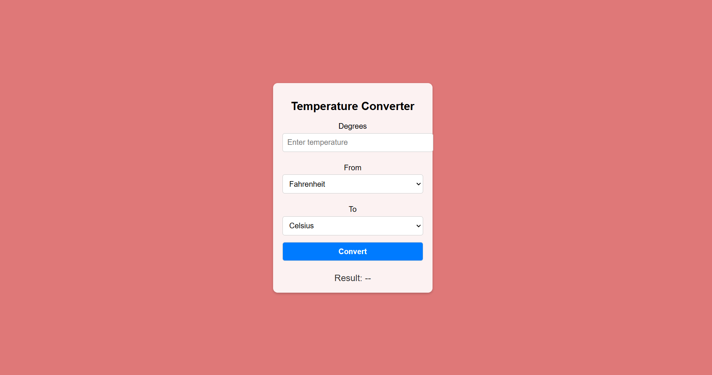

# OIBSIP
there are three project in this file. created for AICTE Oasis Infobyte Internship in domain of "Web Development and Designing" 

# Project Showcase

This repository contains three projects:

1. **Portfolio Website**
   - A modern and responsive portfolio website showcasing my skills, projects, and contact information.
   - **Features**:
     - Interactive design with animations.
     - Sections for About Me, Skills, Projects, and Contact.
   - **Preview**: [Link to video](#portfolio-demo)

2. **VPN Landing Page**
   - A professional landing page for a VPN service.
   - **Features**:
     - User-focused design with call-to-action buttons.
     - Informative sections on features, pricing, and testimonials.
   - **Preview**: [Link to video](#vpn-landing-page-demo)

3. **Temperature Converter**
   - A simple application to convert temperatures between Celsius, Fahrenheit, and Kelvin.
   - **Features**:
     - User-friendly interface.
     - Real-time conversion.
   - **Preview**:
     

---

## Media Demos

### Portfolio Demo

### VPN Landing Page Demo

---
